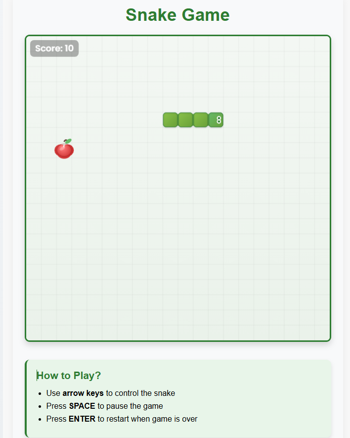

# Snake Game (Angular 20)

[Türkçe](#türkçe) • [English](#english) • [Deutsch](#deutsch)

---

## Türkçe

> Responsive, SSR‑hazır yılan oyunu. Apple ve gölge animasyonu, hareket halinde dil efekti, temiz overlay ekranları ve kalıcı en iyi skor.

### Özellikler

- Responsive oyun alanı (canvas ekranın min boyutunun ~%70'i, merkezde)
- Yüksek DPI (Retina) için net çizim (devicePixelRatio ölçekleme)
- requestAnimationFrame + sabit timestep ile akıcı oyun döngüsü
- UI overlay yapısı: Başlangıç, Duraklatıldı ve Oyun Bitti ekranları
- Oyun sırasında sol üstte canlı skor rozeti
- En iyi skor localStorage ile kalıcı
- Tema altyapısı (classic, neon, pastel) ve kolay renk/ölçek ayarı
- Apple animasyonu: yumuşak “pulse” (küçül-büyü) ve nefes alan gölge
- Yılan animasyonu: hareket ederken ara ara çıkan çatallı dil efekti
- Statik arka plan (yumuşak grid), oyun alanında buton yok (UI ayrı)

### Kontroller

- Ok tuşları: Yön
- SPACE: Duraklat/Aç
- ENTER: Oyun bittiyken yeniden başlat

### Hızlı Başlangıç

```bash
npm start
```

Tarayıcı: http://localhost:4200/

### Derleme (Build)

```bash
npm run build
```

Çıktı: `dist/snake-app`

### SSR (Sunucu Tarafı Rendering)

```bash
npm run build
npm run serve:ssr:snake-app
```

Sunucu girişi: `dist/snake-app/server/server.mjs`

### Proje Yapısı (özet)

- `src/app/snake-game/` — Oyun bileşeni ve stilleri
  - `snake-game.component.ts` — Oyun mantığı ve canvas çizimleri
  - `snake-game.component.html` — Canvas ve overlay şablonları
  - `snake-game.component.css` — Düzen ve overlay stilleri

### Özelleştirme İpuçları

- Apple pulse hızı/derinliği: `drawAppleAtCell()` içindeki `t` ve `pulse`
- Gölge nefes efekti: `shadowScale` formülü
- Dil efekti sıklığı: `drawSnake()` içindeki `flicker` `(now % 1000) < 160`
- Dil boyutu: `tLen`, `tW`, `fork`
- Tema renkleri/ölçekleri: `THEMES`



### CLI ile Geliştirme

```bash
ng generate --help
```

Örnek:

```bash
ng generate component my-component
```

### Lisans

`LICENSE` dosyasına bakın.

---

## English

> Responsive, SSR‑ready snake game. Animated apple and shadow, tongue flick while moving, clean overlays, and persistent best score.

### Features

- Responsive canvas (~70% of the smaller viewport side, centered)
- HiDPI crisp rendering (devicePixelRatio scaling)
- requestAnimationFrame with fixed timestep for smooth gameplay
- HTML overlays: Start, Paused, and Game Over
- In‑game score badge (top-left)
- Best score persisted via localStorage
- Theme presets (classic, neon, pastel) with easy tuning
- Apple animation: gentle pulse and breathing shadow
- Snake animation: occasional forked tongue flick while moving
- Static soft grid background; no buttons inside the play area

### Controls

- Arrow keys: Move
- SPACE: Pause/Resume
- ENTER: Restart when game is over

### Quick Start

```bash
npm start
```

Open http://localhost:4200/

### Build

```bash
npm run build
```

Output: `dist/snake-app`

### SSR

```bash
npm run build
npm run serve:ssr:snake-app
```

Server entry: `dist/snake-app/server/server.mjs`


### Project Structure (brief)

- `src/app/snake-game/` — Game component and styles
  - TS: game logic and canvas drawing
  - HTML: canvas and overlays
  - CSS: layout and overlays

### Customization Tips

- Apple pulse: `t` and `pulse` in `drawAppleAtCell()`
- Shadow breath: `shadowScale`
- Tongue frequency: `flicker` condition
- Tongue size: `tLen`, `tW`, `fork`
- Themes: `THEMES`

---

## Deutsch

> Responsives, SSR‑fähiges Snake‑Spiel. Animierter Apfel mit Schatten, Zungen‑Effekt während der Bewegung, klare Overlays und persistenter Best‑Score.

### Funktionen

- Responsives Spielfeld (Canvas ~70% der kleineren Viewport‑Seite, zentriert)
- Scharfe Darstellung auf HiDPI‑Displays (devicePixelRatio‑Scaling)
- requestAnimationFrame mit fixer Timestep für flüssiges Gameplay
- HTML‑Overlays: Start, Pause und Game Over
- Live‑Punktestand (oben links)
- Bester Score via localStorage gespeichert
- Theme‑Presets (classic, neon, pastel) mit einfacher Anpassung
- Apfel‑Animation: sanftes „Pulsieren“ und atmender Schatten
- Schlange: gelegentliches Zungen‑Zucken während der Bewegung
- Statischer, weicher Gitter‑Hintergrund; keine Buttons im Spielfeld

### Steuerung

- Pfeiltasten: Bewegen
- SPACE: Pause/Fortsetzen
+- ENTER: Neustart nach Game Over

### Schnellstart

```bash
npm start
```

Öffne http://localhost:4200/

### Build

```bash
npm run build
```

Ausgabe: `dist/snake-app`

### SSR

```bash
npm run build
npm run serve:ssr:snake-app
```

Server‑Entry: `dist/snake-app/server/server.mjs`


### Projektstruktur (kurz)

- `src/app/snake-game/` — Spiel‑Komponente und Styles
  - TS: Spiellogik und Canvas‑Zeichnung
  - HTML: Canvas und Overlays
  - CSS: Layout und Overlays

### Anpassungs‑Tipps

- Apfel‑Puls: `t` und `pulse` in `drawAppleAtCell()`
- Schatten‑Atmung: `shadowScale`
- Zungen‑Frequenz: `flicker`
- Zungen‑Größe: `tLen`, `tW`, `fork`
- Themes: `THEMES`
